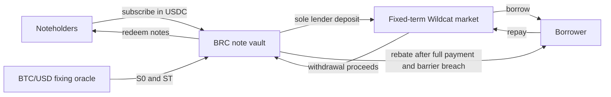

# Wildcat BRC prototype

This repository implements a cash-settled barrier reverse convertible around a fixed-term Wildcat
market. The example links a USDC note to BTC/USD. The vault is the market's sole lender;
noteholders hold claims against the vault rather than Wildcat market tokens.

This is research code. It has no external audit, legal approval, live series or approved release
commit. Nothing here is an offer, price, tax view or suitability assessment.



## Design rules

1. **One lender position.** The vault owns the complete Wildcat lender position. Investors receive
   ERC-20-like note balances and never receive market tokens.
2. **Full raise before activation.** The supported deployment path requires subscriptions equal to
   face notional. An incomplete or unactivated raise can be cancelled and refunded.
3. **One maturity observation.** The implemented note uses a European barrier. It does not monitor
   BTC/USD continuously and has no autocall.
4. **Equality breaches.** `ST <= B` triggers the principal slash. A fixing one unit above the
   barrier does not.
5. **Loss starts at the strike.** Once the barrier is breached, the slash is measured from `K`, not
   from `B`. The barrier therefore creates a cliff.
6. **The borrower earns a rebate only after full performance.** Normal settlement requires zero
   remaining Wildcat lender supply and complete collection of the authenticated withdrawal
   batches. Formal market closure is unnecessary.
7. **Default switches off the BTC payoff.** Recovery reserves the collected pool for noteholders
   and fixes the borrower rebate at zero.
8. **The term is fixed before funding.** Activation verifies the market, hook, sole-lender
   provider, maturity, APR, reserve ratio, early-close policy and borrower identity before the vault
   deposits.
9. **The price rule is explicit.** The current adapter reads the Ethereum Chainlink BTC/USD
   AggregatorV3 proxy and proves the first valid round at or after maturity. Other references need a
   source-specific adapter and review.
10. **Deployment must reproduce the reviewed series.** Borrower-scoped CREATE2 addresses, a
    canonical manifest, atomic deployment checks and a read-only verifier bind the contracts and
    terms together.

## Payoff

Let `N` be face notional, `K` the initial BTC/USD fixing, `B` the barrier and `ST` the maturity
fixing.

```text
principal slash = 0                                when ST > B
principal slash = floor(N * (K - ST) / K)         when ST <= B and ST < K
```

After complete Wildcat performance, the borrower may claim the slash and noteholders receive the
remaining authenticated proceeds, including collected Wildcat interest. In recovery, the borrower
receives no rebate and noteholders share the fixed recovery pool. Noteholders take borrower credit
risk and BTC downside risk without receiving BTC upside.

The [worked example](docs/bd/worked-example.md) walks through an unbreached note, the barrier cliff,
a full BTC-linked loss and a borrower default.

## Repository map

- `src/` contains the vault, fixing oracle, payoff library, borrower account and deployment logic.
- `test/` contains unit, fuzz, deployment, recovery and stateful invariant coverage.
- `script/` contains the manifest parser, deployer, verifier and repository checks.
- `config/series.example.json` is an incomplete example, not a deployable series.
- `docs/architecture.md`, `docs/product-terms.md` and `docs/threat-model.md` define the implemented
  system and its boundaries.
- `docs/deployment-tooling.md`, `docs/runbook.md` and `docs/operations-checklists.md` cover deployment
  and operation.
- `docs/review-packet.md` and `docs/validation-evidence.md` record the review scope, available
  evidence and release blockers.
- `docs/research/` contains the instrument history, source index and dated survey of reference
  assets and oracle routes.
- `docs/bd/` contains the meeting brief, worked example, lender and borrower notes, discovery guide,
  FAQ and editable infographic source.

Generated build output, controller records and temporary renders do not belong in the authored
tree. Deployment records are series artefacts and remain untracked unless a release process says
otherwise.

## Run the prototype

The repository pins its dependencies in `config/dependencies.env`.

```bash
git submodule update --init --recursive
./script/check-dependencies.sh
FOUNDRY_PROFILE=ci forge test --summary
./script/check-markdown.sh
./script/check-primer-examples.sh
./script/check-mermaid.sh
```

The Foundry profile uses Solidity 0.8.28, the Cancun EVM, 200 optimiser runs and via IR. Production
contracts were last changed in `efb880e3d79ba12709d68c850b9321eeb19d7cfb`. That commit is a code
baseline, not a release approval. A real series must name one frozen, externally reviewed release
commit in its manifest.

The Wildcat integration is pinned to `wildcat-finance/v2-protocol` commit
`99bb85840a77a56fa5f64504a60ec126b6047cf5`, selected from
[`v2-protocol` PR 124](https://github.com/wildcat-finance/v2-protocol/pull/124). The commit is the
build input regardless of the pull request's later state.

## Current edge

The repository can deploy and exercise the BTC/USD research series in tests. A live series still
needs an external contract review, legal and regulatory advice, data and product-rights clearance,
a completed manifest, approved counterparties, a mainnet-fork verifier run and independent maturity,
fallback and recovery rehearsals.

The prototype has no continuous barrier, physical BTC delivery, generic oracle switch, contract-
wallet fallback ratifiers, wrapper, upgrade path, pause or administrator sweep. Wildcat governance,
SphereX, sanctions handling, borrower-identity changes, the settlement token and Chainlink feed
administration remain external assumptions. Payments or donations arriving after the recovery
snapshot do not enlarge noteholder claims and may remain trapped in the vault.

## Reading order

- Product or credit discussion: [one-page](docs/bd/one-page.md) → [worked
  example](docs/bd/worked-example.md) → [primer](docs/primer.md).
- Lender discussion: [lender brief](docs/bd/lender-brief.md) →
  [FAQ](docs/bd/faq.md) → [review packet](docs/review-packet.md).
- Borrower discussion: [borrower brief](docs/bd/borrower-brief.md) → [product
  terms](docs/product-terms.md) → [discovery guide](docs/bd/discovery-guide.md).
- Technical review: [architecture](docs/architecture.md) → [threat
  model](docs/threat-model.md) → [validation evidence](docs/validation-evidence.md).
- Deployment: [deployment tooling](docs/deployment-tooling.md) →
  [runbook](docs/runbook.md) → [operator checklists](docs/operations-checklists.md).
- Reference research: [instrument history](docs/research/instrument-history.md) → [reference assets
  and oracles](docs/research/reference-assets-and-oracles.md) → [source
  index](docs/research/sources.md).
