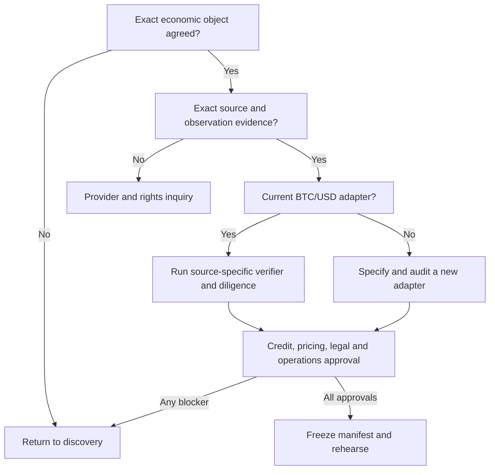

# BRC discovery guide

Use this guide for the first two counterparty conversations. Its purpose is to turn an idea into a
reviewable design brief. It is not a term sheet and should not be presented as one.

## Rule for the room

Agree the economic reference before discussing an oracle ticker. “The S&P”, “gold”, “Treasuries”
and “NAV” are not specifications. The [oracle survey](../research/reference-assets-and-oracles.md)
shows the choices hidden inside each label.

## A 45-minute first call

| Minutes | Topic | Output |
| ---: | --- | --- |
| 0-5 | Why this shape? | One sentence naming the risk to transfer |
| 5-12 | Parties and credit | Borrower, lender type, issuer/vault role, size and plain-credit comparison |
| 12-22 | Payoff | Exact reference, strike, barrier, term, observation and maximum loss |
| 22-30 | Data and operations | Source route, calendar, fallback, settlement asset and operators |
| 30-38 | Distribution and governance | Eligible holders, transfer, custody, reporting, jurisdictions and change control |
| 38-45 | Evidence and next step | Owners for pricing, credit, engineering, data rights, legal and accounting |

If the conversation reaches APR before maximum principal loss and the barrier cliff are understood,
move back to the payoff.

## Design brief

### 1. Purpose and parties

| Field | Question | Decision |
| --- | --- | --- |
| Borrower need | Which loss or capital need should the contingent rebate offset? | |
| Borrower | Which legal entity owes Wildcat and signs the documents? | |
| Rebate recipient | Which immutable address receives a normal-settlement rebate? | |
| Lender group | Institutions, funds, crypto lenders, banks or another professional class? | |
| Issuance role | Who operates the vault and carries any offchain note obligation? | |
| Size | Target notional and minimum economic size? | |
| Plain-credit baseline | What terms apply without the linked payoff? | |

### 2. Exact reference

| Field | Question | Decision |
| --- | --- | --- |
| Economic object | Spot asset, ETF share, index, future, NAV, yield, rate, reserve or basket? | |
| Identifier | Full legal/product name, not ticker alone | |
| Quote and units | USD, USDC, percentage, yield bips, fund units or another convention? | |
| Venue or publisher | Which exchanges, administrator, calculation agent or oracle sources? | |
| Adjustments | Splits, dividends, forks, rolls, rebalances, mergers, corrections and cessation? | |
| Rights | Who permits issuance, settlement, display and marketing? | |

For the current prototype, the answer is the Ethereum Chainlink BTC/USD reference-price proxy.
Every other answer starts as new design work.

### 3. Payoff

| Field | Question | Decision |
| --- | --- | --- |
| Settlement asset | Which ERC-20 funds, accrues and settles the note? | |
| Notional | Face amount and base-unit convention? | |
| Strike | Initial fixing, another level or stated number? | |
| Barrier | Percentage or absolute level? | |
| Equality | Does equality breach? The prototype says yes. | |
| Observation | European, daily, continuous or autocall schedule? | |
| Loss formula | From strike, barrier or another participation rate? | |
| Upside | None in the prototype; is any participation proposed? | |
| Cash flow | Accumulated settlement return or running coupon? | |
| Maximum loss | Exact face and interest outcome at zero reference value? | |

Run at least these scenarios: above strike, one unit above barrier, exactly at barrier, midway below
barrier, zero, full Wildcat payment, partial recovery and zero recovery.

### 4. Dates and market calendar

| Field | Question | Decision |
| --- | --- | --- |
| Funding deadline | When must the full raise be complete? | |
| Activation deadline | Last valid activation time? | |
| Maturity | Timestamp and time zone? | |
| Eligible session | Regular, extended, overnight, 24/7 or administrator close? | |
| Holiday | Preceding, following or next open session? | |
| Halt or stale value | Wait, use last good, fallback or cancel? | |
| Observation window | How long may primary evidence arrive? | |
| Recovery delay | How long after maturity before unpaid supply can enter recovery? | |
| Write-off | When does the recovery pool become terminal? | |

Do not call `recoveryDelay` the Wildcat grace period. Wildcat's `delinquencyGracePeriod` is a
separate debt-accounting term.

### 5. Oracle and fallback

| Field | Question | Decision |
| --- | --- | --- |
| Primary | Exact chain, address or report ID, schema and source status? | |
| Eligibility | First valid value, named close or certified fixing? | |
| Freshness | Timestamp and future-skew bounds? | |
| History | Can the eligible maturity value be proved after the fact? | |
| Fallback source | Exact named evidence source and retrieval method? | |
| Ratifiers | ECDSA EOAs, threshold, rehearsal and replacement policy? | |
| Challenge | Delay, veto, evidence record and incident owner? | |
| Rights and fees | Access, billing, product use and redistribution permission? | |

The current fallback ratifiers are immutable ECDSA EOAs. A Safe address is not a supported
substitute.

### 6. Wildcat credit and settlement

| Field | Question | Decision |
| --- | --- | --- |
| APR and reserve | Proposed values and plain-credit rationale? | |
| Fees | Starting protocol fee, ceiling, recipient and change risk? | |
| Withdrawal batch | Duration and final safe queue horizon? | |
| Delinquency | Grace period, fee, reporting and cure plan? | |
| SphereX | Current engine/admin/operator and response to a blocked call? | |
| Sanctions | Screening, escrow and legal fallback? | |
| Recovery | Delay, write-off, late-payment treatment and borrower zero rebate? | |

### 7. Holders, custody and reporting

- Who may subscribe, hold, transfer, operate or receive redemption?
- Is note transfer open, allow-listed or prohibited in practice?
- Which wallet and custody systems support the notes and fallback signatures?
- Is there any planned secondary venue, and who is responsible for it?
- Which borrower credit, market, oracle and incident reports are delivered, and how often?
- Who supplies valuation statements before maturity and after a barrier breach?

No secondary liquidity should be assumed unless a separate arrangement exists.

### 8. Legal, tax and accounting work

- Issuer, borrower and holder jurisdictions
- securities, derivatives, lending, financial-promotion and professional-investor analysis
- sanctions, AML/KYC, transfer and custody requirements
- benchmark, index, market-data and trademark rights
- tax character for each party and cash flow
- debt, embedded derivative, fair-value and hedge-accounting treatment
- insolvency, netting, enforcement and late-recovery treatment
- legal document hierarchy between the Wildcat debt, option economics and note terms

Historical Swiss treatment is not a conclusion for this product. The [instrument history](../research/instrument-history.md)
states the narrow source and its limits.

## Route decision after the call

## Follow-up note template

After the meeting, send one page containing:

1. the risk each side is trying to exchange;
2. the exact economic reference and observation rule;
3. notional, term, barrier, loss formula and maximum loss;
4. plain-credit and option-pricing owners;
5. primary source, fallback and data-rights status;
6. holder, transfer, custody and jurisdiction assumptions;
7. unresolved engineering, operational, legal, tax and accounting questions; and
8. the next evidence owner and date.

Label it “discussion record, not terms”. Do not fill a missing answer with the repository example.

After the call, test the record against the [reference-asset survey](../research/reference-assets-and-oracles.md)
and the [external review packet](../review-packet.md). A missing owner, source or legal answer stays open.
