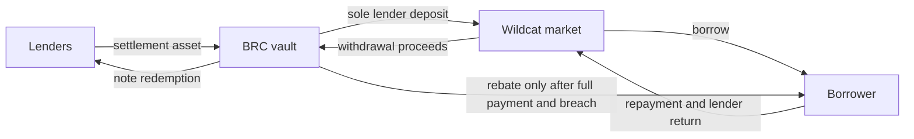
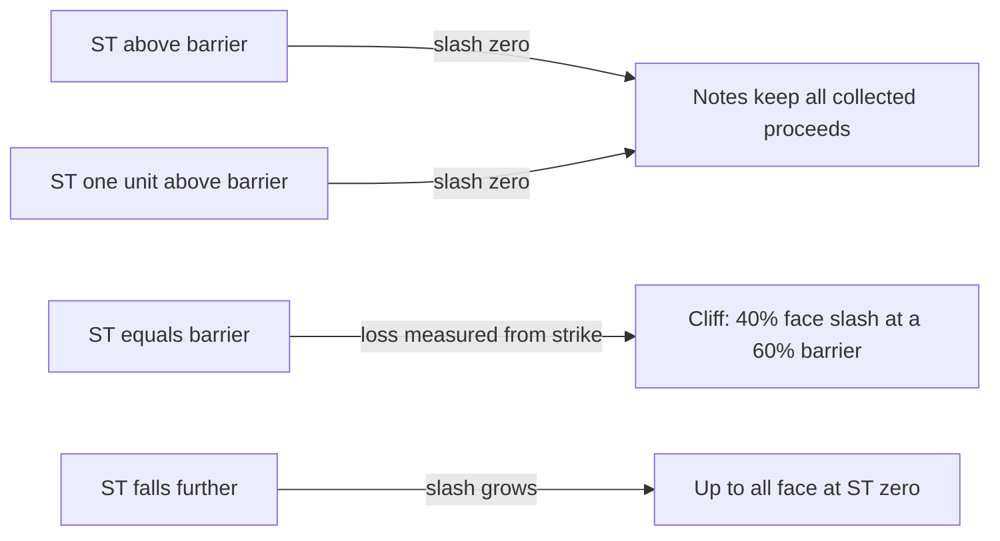
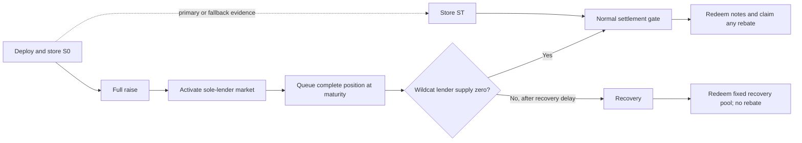
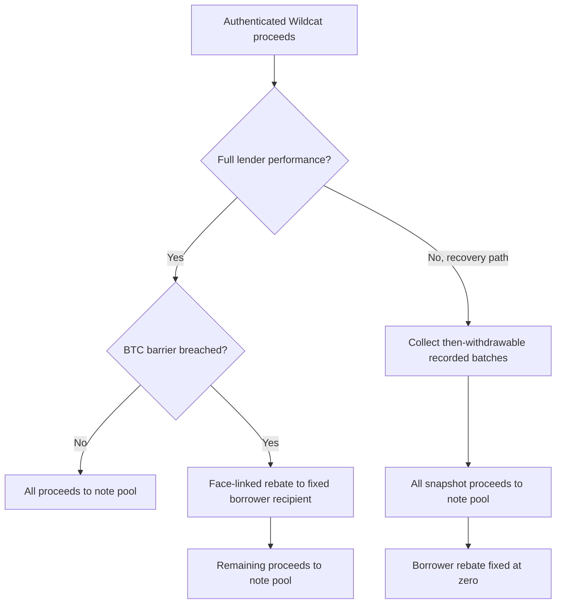
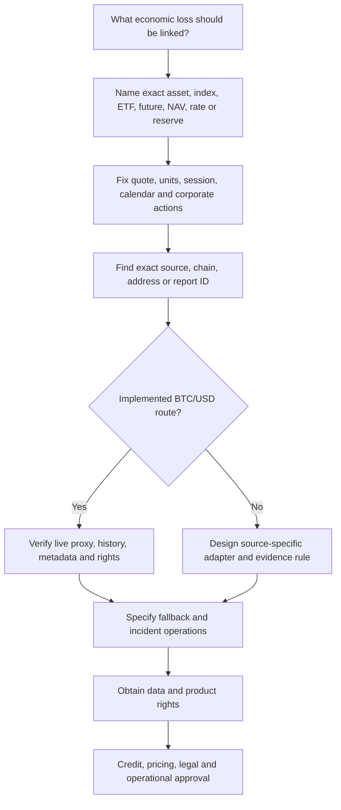
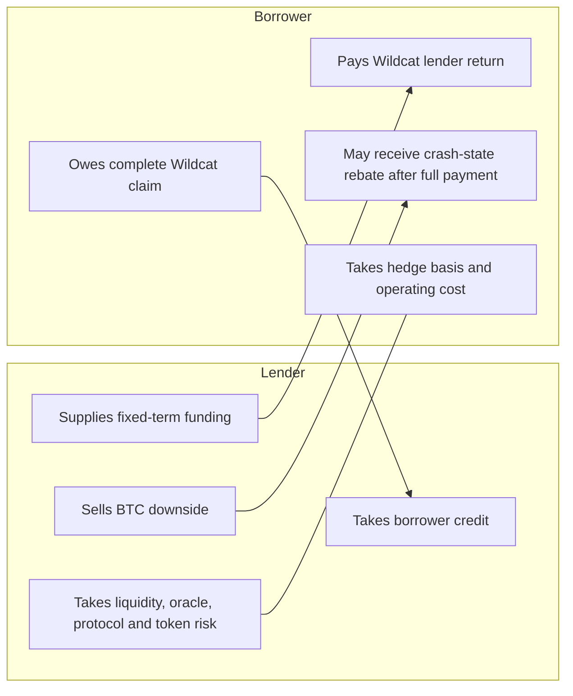

# BRC infographic sourcebook

These diagrams are source-controlled meeting aids. They explain relationships; they are not legal
structure charts, transaction confirmations or proof that a series is ready. Copy the Mermaid
source into a deck only with the boundary and labels intact.

## 1. Money flow

The vault, not each noteholder, is the sole direct Wildcat lender. The borrower rebate is a vault
settlement payment after complete Wildcat performance.

## 2. Barrier cliff

This is a European maturity observation. Equality breaches. The lender receives no BTC upside and
the slash applies to face, not collected interest.

## 3. Contract lifecycle and independent oracle track

Queueing does not wait for `ST`. Recovery does not use the BTC payoff.

## 4. Normal and recovery waterfalls

Normal settlement preserves any earned borrower rebate. Recovery deliberately does not.

## 5. Reference and oracle selection

Do not start with a ticker search. Technical availability and permission to settle a financial
product are separate.

## 6. The risk exchange

The economic shorthand is unsecured borrower credit plus a put sold by lenders. Neither side
should reduce the discussion to headline APR.

## Presentation notes

- Put the barrier-cliff diagram beside the example payoff table from the [one-page](one-page.md).
- Use the waterfall diagram when explaining why default cannot create a rebate.
- Use the oracle-selection diagram before discussing a new reference asset.
- Keep “BTC/USD implemented; all other sources require review” on any extracted slide.
- Keep the prototype status and missing external audit, legal approval and live series on the final
  slide or follow-up page.
