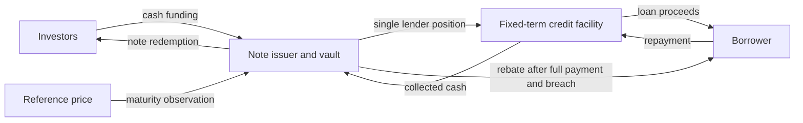
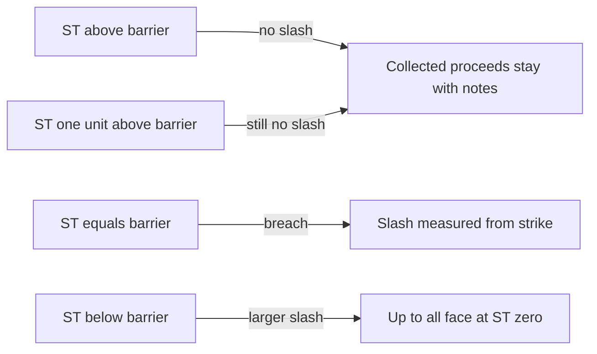
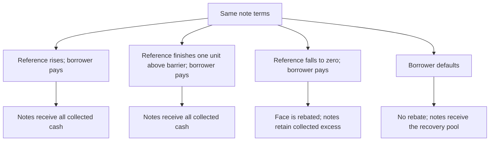
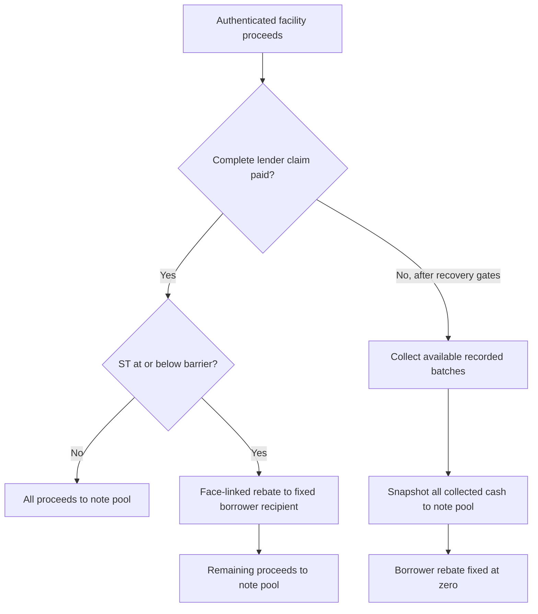
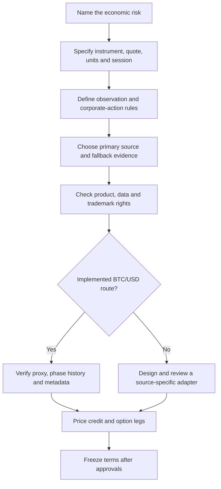
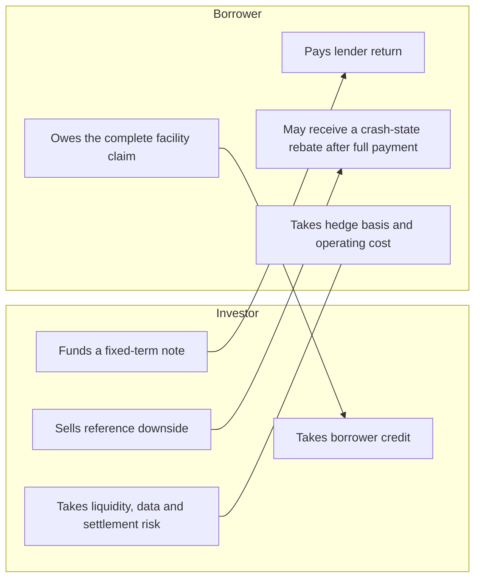

# BRC infographic sourcebook

These diagrams are editable meeting aids for BD and credit discussions. They explain the economic
relationships in the research prototype. They are not legal structure charts, transaction
confirmations or evidence that a series is ready.

Keep exact terms, addresses, dates and disclaimers as editable text. Use wide slides, generous
margins and one idea per frame. The palette is Bunker `#141414`, Black Rock `#30313E`, Manatee
`#8A8C9F`, Athens Grey `#EFF0F4`, white, Ultramarine Blue `#3E68FF`, Purple Heart `#4D26BC`, Dull
Red `#C24647` and Galliano `#D7A820`. Use red only for loss or recovery stress.

## 1. The cash-credit trade

Open with the commercial structure. Wildcat is the accounting route inside the prototype, not the
first thing the room needs to understand.

Room note: “Investors fund a fixed-term borrower and sell a defined piece of reference-price
downside. The borrower pays the facility before any reference-linked rebate can be made.”

## 2. The barrier cliff

The barrier is a trigger, not the point from which loss is measured.

Use these editable callouts beside the figure:

| Maturity BTC/USD | Barrier result | Borrower rebate | Noteholder pool |
| ---: | --- | ---: | ---: |
| 60,001 | No breach | 0 | 1,030,000 |
| 60,000 | Breach | 400,000 | 630,000 |

The example assumes `N = 1,000,000`, `K = 100,000`, `B = 60,000` and total authenticated proceeds
of `1,030,000`. The proceeds are a round payoff input rather than an APR accrual calculation.
Equality breaches. The [worked example](worked-example.md) gives the complete talk track.

## 3. Four commercial outcomes

These are economic outcomes rather than contract states.

Keep the crash and default branches separate. Full borrower performance enables the reference-
linked rebate. Default disables it.

## 4. Normal settlement and recovery

This figure explains where collected cash goes.

Room note: “A default cannot earn the borrower a rebate. It leaves noteholders with the fixed
recovery pool.”

## 5. Reference and data-rights selection

Use this before discussing a new asset or index.

Technical availability and permission to settle a financial product are separate questions. The
current code implements the Ethereum Chainlink BTC/USD AggregatorV3 route only.

## 6. The risk exchange

This is the credit-committee view of the trade.

The shorthand is unsecured borrower credit plus a put sold by investors. A return discussion that
omits either exposure is incomplete.

## Use in a meeting

1. Start with the cash-credit trade.
2. Show the barrier cliff before discussing return.
3. Walk the four outcomes with the same numbers.
4. Use the settlement figure to separate full performance from default.
5. Use the source-selection figure before naming a new reference.
6. Finish with the risk exchange and the prototype status.

Pair any extracted figure with the [one-page](one-page.md), [worked example](worked-example.md) and
[FAQ](faq.md). Keep “research prototype; no external audit, legal approval or live series” on the
final page.
