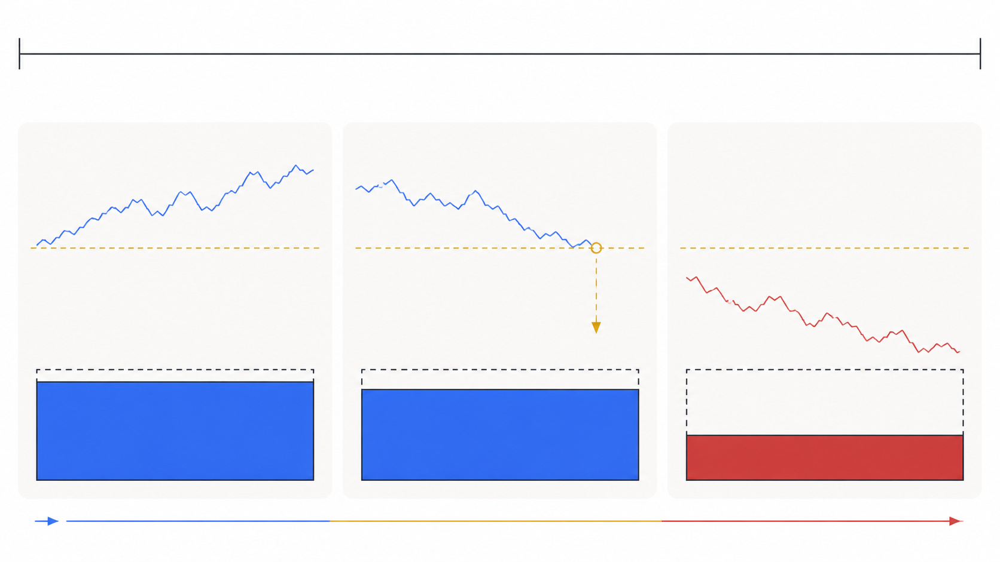
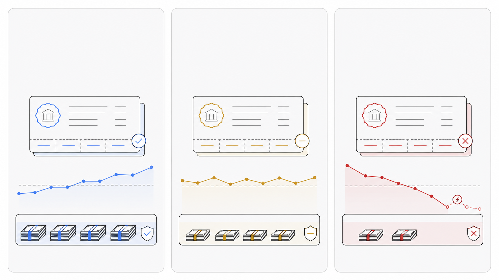
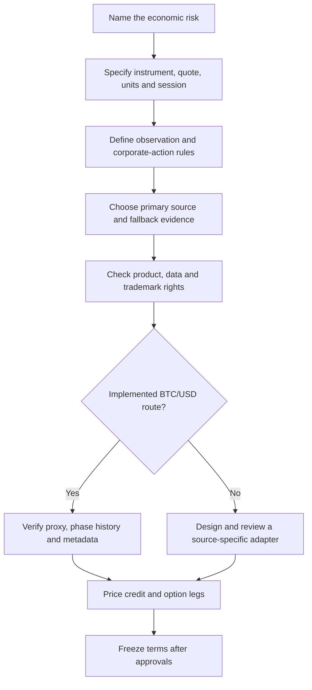
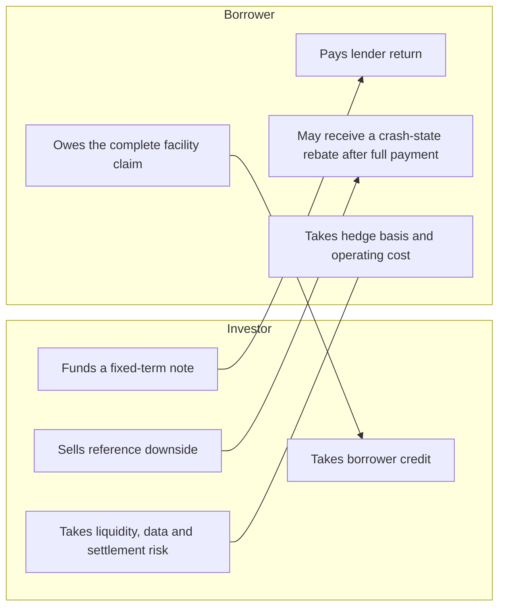

# Deal diagrams

These are screen-ready pictures and editable source notes for BD and credit discussions. The images
set the mood; exact labels, numbers and disclaimers belong in Markdown or the deck layer.

This is not a legal structure chart, transaction confirmation or evidence that a series is ready.

## One loan, one trigger


Use this as the opener. Say: “investors fund the borrower through one note issuer; the reference
price only decides the maturity waterfall after the borrower has performed.”

Suggested labels:

- Investors fund the note.
- Note issuer holds the lender position.
- Borrower repays the facility.
- One maturity reference price controls the rebate.

## Barrier cliff



Use this before discussing return. The point is the cliff: `60,001` is no breach; `60,000` breaches;
the loss is measured from the `100,000` strike.

Editable callouts:

| Maturity BTC/USD | Barrier result | Borrower rebate | Noteholder pool |
| ---: | --- | ---: | ---: |
| `60,001` | No breach | `0` | `1,030,000` |
| `60,000` | Breach | `400,000` | `630,000` |

The example assumes `N = 1,000,000`, `K = 100,000`, `B = 60,000` and total authenticated proceeds
of `1,030,000`. Equality breaches.

## Happy, neutral and catastrophic paths



Use this with [the worked example](worked-example.md). Keep the three conversations separate:

| Path | Room read |
| --- | --- |
| Happy | BTC finishes above the barrier and the borrower pays. Notes receive the collected cash. |
| Neutral | BTC finishes one unit above the barrier and the borrower pays. Still no rebate. |
| Catastrophic | BTC falls hard. If the borrower pays, the BTC rebate can consume face. If the borrower defaults, no rebate is paid. |

## Settlement and recovery

This figure is still better as editable source because the labels carry the legal/economic meaning.


Room note: “A default cannot earn the borrower a rebate. It leaves noteholders with the fixed
recovery pool.”

## Reference and data-rights selection

Use this before discussing a new asset or index.



Technical availability and permission to settle a financial product are separate questions. The
current code implements the Ethereum Chainlink BTC/USD AggregatorV3 route only.

## Risk exchange

The shorthand is unsecured borrower credit plus a put sold by investors. A return discussion that
omits either exposure is incomplete.



## Image generation prompts

Use generated bitmap assets for mood panels and story beats, not exact maths. Generated images must
not contain words, numerals, tickers, addresses, logos or watermarks.

### Scenario panel prompt

```text
Use case: productivity-visual
Asset type: 16:9 three-panel scenario illustration, no embedded text
Primary request: Three adjacent institutional finance panels showing the same credit note through
happy, neutral and catastrophic market paths. Panel one is calm and fully paid, panel two is tight
but still performing, panel three is stressed with a broken price line and reduced cash pool.
Style: Wildcat brand, editorial line art, light background, Ultramarine Blue for happy, Galliano
for neutral, Carmine Pink for catastrophic, thin Bunker strokes and pale rounded cards.
Composition: Three equal vertical panels with empty label space above each; abstract ledgers, cash
pools and reference-price lines; sparse and professional.
Avoid: embedded text, letters, words, numerals, logos, watermarks, coins, exchange screens,
blockchain nodes, glowing networks and photoreal bankers.
```

### Risk-exchange prompt

```text
Use case: productivity-visual
Asset type: 16:9 institutional risk-exchange illustration, no embedded text
Primary request: An abstract bilateral finance visual showing investors on one side, a borrower on
the other, and two exchanged legs: credit funding and reference-asset downside. Use ledger cards,
arrows and a small reference-price panel.
Style: Wildcat brand, pale background, Bunker linework, Blue Ribbon for funding, Carmine Pink for
downside, restrained finance editorial style.
Composition: Two large zones with clean space for overlaid bullet labels.
Avoid: DeFi protocol diagrams, token icons, words, numerals, people shaking hands, logos and neon.
```

## Use in a meeting

1. Start with one loan, one trigger.
2. Show the barrier cliff before discussing return.
3. Walk the happy, neutral and catastrophic paths with the same numbers.
4. Use the settlement figure to separate full performance from default.
5. Use the source-selection figure before naming a new reference.
6. Finish with the risk exchange and prototype status.

Pair any extracted figure with the [one-page](one-page.md), [worked example](worked-example.md) and
[FAQ](faq.md). Keep “research prototype; no external audit, legal approval or live series” on the
final page.
