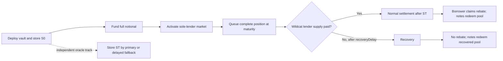

# A practical primer on the Wildcat BTC barrier reverse convertible

This is the quickest route from “what is a BRC?” to the prototype in this repository. It explains
the code; it is not an offer, recommendation, tax opinion or statement that the contracts are ready
for production.

## The trade

Investors lend a settlement asset through one vault. The vault is the only direct lender in a
fixed-term Wildcat market. Investors receive vault note balances rather than Wildcat market tokens.

The borrower pays the Wildcat lender return. In exchange for a higher funding cost than plain debt
might carry, the borrower can receive a rebate at maturity if BTC/USD finishes at or below the
barrier. The rebate reduces what noteholders receive from a completely paid Wildcat claim.

Economically, the lender holds borrower credit and sells the borrower a BTC put. The lender gets no
BTC upside. The borrower gets no rebate merely by defaulting.

## What is fixed in the example

| Term | Example |
| --- | --- |
| Settlement asset | USDC in the example manifest; the contract checks the configured ERC-20 |
| Face notional, `N` | 1,000,000 USDC |
| Term | 90 days |
| Wildcat APR | 12%, encoded as 1,200 bips |
| Initial fixing and strike, `K` | Chainlink BTC/USD `S0` recorded at vault deployment |
| Barrier, `B` | 60% of `S0` |
| Maturity fixing, `ST` | First valid Chainlink BTC/USD proxy round at or after maturity within the allowed window |
| Observation style | European: one maturity observation |
| Breach rule | `ST <= B`; equality is a breach |
| Settlement | Cash in the settlement asset |
| Direct Wildcat lender | The vault only |

The deployable manifest requires a full raise. The current oracle adapter is the Ethereum Chainlink
BTC/USD AggregatorV3 proxy. Changing the asset or oracle product takes new code and review; it is not
a manifest switch.

## Who does what

| Party | Job | Exposure or authority |
| --- | --- | --- |
| Noteholder | Supplies funding and owns notes | Borrower credit, BTC downside, liquidity, oracle and recovery risk |
| Vault | Holds the complete Wildcat lender position | Applies fixed funding, payoff, settlement and recovery rules |
| Borrower account | Deploys the bound vault and market, then operates the Wildcat borrower | Owes the Wildcat claim and receives any normal-settlement rebate at the fixed recipient |
| Wildcat market | Accounts for debt, interest, repayment and withdrawal batches | External protocol, fee, sanctions and SphereX assumptions |
| Chainlink proxy | Supplies the primary `S0` and `ST` evidence | Feed availability, phase history and administrator assumptions |
| Fallback ratifiers | Approve a delayed price only if the primary path remains unavailable | Immutable ECDSA EOA set; threshold approval and one-ratifier veto |
| Keepers | Call permissionless lifecycle functions | Cannot choose the fixing, payout recipient or amount |

## The payoff

Let `P` be the authenticated Wildcat assets collected after complete lender payment.

```text
if ST > B:
    principalSlash = 0
else:
    principalSlash = floor(N * (K - ST) / K)

borrowerRebate = principalSlash
noteholderPool = P - borrowerRebate
```

The principal slash is capped by `N` because `ST` cannot be negative. It applies to face principal,
not the Wildcat interest collected above principal. Solidity integer division rounds the slash down
in favour of the noteholder pool. Redemption divisions also round down, with the final redeemer
receiving the remaining dust.

### Worked full-performance outcomes

Assume `N = 1,000,000 USDC`, `K = 100,000`, `B = 60,000` and authenticated Wildcat proceeds
`P = 1,030,000 USDC`.

| `ST` | Barrier result | Principal slash / borrower rebate | Noteholder pool | Meaning |
| ---: | --- | ---: | ---: | --- |
| 120,000 | No breach | 0 | 1,030,000 | Notes keep all principal and collected interest; no BTC upside |
| 60,001 | No breach | 0 | 1,030,000 | One feed unit above the barrier avoids the put payoff |
| 60,000 | Breach | 400,000 | 630,000 | Equality triggers loss from the 100,000 strike, not merely below 60,000 |
| 40,000 | Breach | 600,000 | 430,000 | Notes keep 40% of face plus the 30,000 collected interest |
| 0 | Breach | 1,000,000 | 30,000 | Face principal goes to the rebate; collected interest remains for notes |

This is the barrier cliff. The result moves from no slash at `60,001` to a 40% face slash at
`60,000`. A prospective lender needs to see that before discussing APR.

### A rounding example

With `N = 1,000,001`, `K = 3`, `B = 2` and `ST = 2`, equality breaches. The exact fraction is
`1,000,001 / 3`; the contract returns a principal slash of `333,333` settlement-asset base units.
It does not round up.

## Full performance and recovery are different products states

The BTC formula runs only through normal settlement. Normal settlement requires the Wildcat lender
supply to be zero and every recorded withdrawal batch to be completely burned and collected. The
borrower does not need to close the otherwise empty market formally.

Recovery starts from `Withdrawing` after `maturity + recoveryDelay` only while Wildcat lender
supply remains unpaid. After the fixed write-off time and batch expiries, the vault collects every
amount then withdrawable and reserves it all for noteholders.

Suppose the same series has `ST = 40,000`, but only 650,000 USDC has been recovered by the terminal
snapshot. In normal settlement, that BTC price would imply a 600,000 borrower rebate. In recovery,
the rebate is zero and the noteholder pool is the full 650,000. Later Wildcat payments and direct
token donations do not enlarge the fixed recovery pool.

The rule is deliberate: BTC downside can reduce a fully performed debt claim, but borrower default
cannot manufacture extra liability relief.

## Lifecycle



Queueing does not wait for `ST`. That prevents an oracle delay from creating a missed withdrawal
window. Normal finalisation still waits for the stored fixing. Recovery does not use the BTC price.

## What the return is paying for

The Wildcat APR is not free yield. A lender is accepting several exposures at once:

- **Borrower credit:** the note depends on the Wildcat borrower paying the lender claim.
- **Short BTC put:** a barrier breach can remove up to all face principal after full performance.
- **Cliff risk:** the loss is measured from `K` once `ST <= B`.
- **No BTC upside:** a BTC rally does not raise the note payoff.
- **Liquidity:** the prototype offers no guaranteed secondary market or vault exit before maturity.
- **Oracle risk:** primary settlement depends on a specific proxy history and a bounded proof; the
  fallback depends on the fixed ratifier set.
- **Protocol and governance risk:** Wildcat fees, sanctions handling, identity state and SphereX can
  affect the position.
- **Settlement-token risk:** a stablecoin can depeg, freeze or change behaviour independently of
  BTC and the borrower.

The borrower is buying contingent liability relief. The commercial rate must therefore cover plain
credit, the BTC option value, liquidity and operating risk. This repository does not price those
components.

## What this prototype does not do

- It does not pay a periodic cash coupon; the Wildcat lender return is collected at settlement.
- It does not observe a continuous or daily barrier.
- It does not autocall or let the borrower shorten the term.
- It does not deliver BTC or shares.
- It does not support arbitrary Chainlink feeds, Data Streams or other oracle providers.
- It does not promise a liquid secondary market, principal protection or recovery after the fixed
  snapshot.
- It does not establish the tax, accounting, securities-law or prudential treatment of a live note.
- It has no external audit, legal sign-off, final series manifest or approved production deployment.

## Questions to settle before pricing a series

1. Who is the legal borrower, note issuer and fixed rebate recipient?
2. What credit spread would lenders demand for the Wildcat borrower without the BTC feature?
3. What option premium corresponds to the chosen strike, barrier, term and observation rule?
4. What size, settlement asset, APR and recovery timetable can both sides support?
5. Who may hold or transfer notes, and under which jurisdictions and documents?
6. Does the exact reference data carry the rights needed for a financial product?
7. Who operates maturity, fallback and recovery calls, and who funds those keepers?
8. How will each side account for and hedge the credit and option legs?

## Glossary

- **Barrier:** the price threshold that activates the contingent principal formula.
- **Borrower rebate:** the normal-settlement amount transferred from collected Wildcat proceeds to
  the borrower recipient after a breach.
- **European observation:** the barrier is tested at one maturity observation, not throughout the
  term.
- **Face notional (`N`):** the initial principal represented by all notes.
- **Principal slash:** the BTC-linked reduction in the noteholder pool after full performance.
- **Recovery pool:** authenticated Wildcat assets collected and fixed for noteholders after default;
  it carries no borrower rebate.
- **Reverse convertible:** issuer debt combined economically with a put sold by the investor.
- **Strike (`K`):** the initial BTC/USD fixing `S0` in this example.
- **Maturity fixing (`ST`):** the accepted BTC/USD price for the maturity observation.

For the sourced market history, read [Reverse convertibles: history, relatives and lessons for
Wildcat](research/instrument-history.md). For the exact contractual research terms, read [Example
BTC BRC terms](product-terms.md).

For a counterparty conversation, continue with the [lender brief](bd/lender-brief.md) or [borrower
brief](bd/borrower-brief.md). Neither brief replaces the technical terms above.
