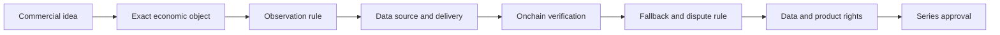

# Reference assets and onchain oracle routes

Checked on 16 August 2026. This is a research catalogue for product discovery, not a list of
assets supported by the contracts. The prototype has one primary oracle route: the Ethereum
mainnet Chainlink BTC/USD `AggregatorV3` proxy described below. Every other row needs new evidence,
new code, commercial work or some combination of the three.

## Read the labels literally

| Label | Meaning |
| --- | --- |
| **Implemented** | The present contracts, manifest and tests cover this exact source shape. It is still research code, not an approved series. |
| **Address-verified candidate** | A first-party catalogue published an exact contract address on the named chain. The current BRC adapter does not support it unless the row also says implemented. |
| **Catalogue candidate** | A first-party catalogue or guide names the product, feed or stream. Its exact chain, identifier, access terms and current status still need checking. |
| **Inquiry only** | A provider describes the data class or bespoke service, but no suitable public series source was verified. |

These labels expire. A feed can change aggregator, delivery schema, heartbeat, access policy or
status. A release candidate needs a fresh address-level and code-level readback.

## Start with the economic object

“Gold”, “the S&P” and “Treasuries” are not oracle specifications. Each can mean several things
whose prices diverge.

Before discussing a provider, write down:

- the legal and economic reference: spot asset, exchange print, ETF share, index level, futures
  contract, NAV, redemption rate, yield, reserve quantity or calculated basket;
- the quote currency, units and treatment of negative or missing values;
- the observation time, time zone, calendar, eligible trading session and treatment of halts;
- whether the note needs the first eligible value, a named close, a time-weighted value or a
  publisher-certified fixing;
- the correction, rebasing, split, merger, roll and index-reconstitution rules; and
- who has the right to use that data to issue, settle and market the product.

An onchain number answers only part of that list.

## What the prototype actually reads

The implemented primary source is Chainlink's Ethereum mainnet BTC/USD Data Feed proxy at
`0xF4030086522a5bEEa4988F8cA5B36dbC97BeE88c`. Chainlink's [feed page](https://data.chain.link/feeds/ethereum/mainnet/btc-usd)
names the product `BTC/USD-RefPrice-DF-Ethereum-001` and, as checked on 16 August 2026, publishes a
0.5% deviation threshold. The manifest must still pin and verify the live address, code hash,
decimals, description and governance state for a real deployment.

`BtcUsdFixingOracle` expects more than `latestRoundData()`:

1. The proxy and each relevant phase aggregator must expose the expected decimals and description.
2. The initial fixing must be positive, complete, fresh, not in the future and recorded before
   maturity.
3. The maturity fixing must be the first valid proxy round at or after maturity and no later than
   the observation deadline.
4. The caller supplies a valid pre-maturity predecessor. The contract walks at most 32 intervening
   round identifiers and fails closed on unreadable evidence.
5. Phase changes are resolved through `phaseAggregators(uint16)`, and the candidate round is checked
   against its underlying aggregator.
6. A valid primary proof can cancel an active fallback proposal. A final fallback fixing cannot be
   replaced by a later primary value.

This proves a particular historical-round rule for a Chainlink proxy. It does not make every
single-value feed interchangeable. The source description is BTC-specific, the product terms are
BTC-specific, and the deployment record pins the source.

### Nearby Chainlink feeds are still unsupported

| Source | Evidence checked | Status | Work before use |
| --- | --- | --- | --- |
| BTC/USD on Ethereum | Exact official proxy page and current contract integration | **Implemented** | Complete a live manifest, recheck the proxy and run the mainnet-fork verifier |
| ETH/USD on Ethereum | [Official feed page](https://data.chain.link/feeds/ethereum/mainnet/eth-usd) publishes an exact proxy | **Address-verified candidate** | Generalise naming and terms, inspect phase history, add fixtures and fork tests, approve rights |
| LINK/USD on Ethereum | [Official feed page](https://data.chain.link/feeds/ethereum/mainnet/link-usd) publishes an exact proxy | **Address-verified candidate** | Same work as ETH/USD; no support follows from the shared interface |

The current preference for BTC/USD is not a claim that it can never fail. Chainlink tells
integrators to monitor timestamps, deviation and heartbeat behaviour, aggregator changes, extreme
market events and outages in its [Data Feeds guidance](https://docs.chain.link/data-feeds). The
delayed ratifier path exists because a time-bounded fixing must still have a documented route when
the primary evidence cannot be proved.

## Chainlink is several products, not one adapter

| Chainlink route | Data and delivery | Status for this BRC | Required work |
| --- | --- | --- | --- |
| Data Feeds | Values are pushed to onchain proxy/aggregator contracts on deviation or heartbeat rules | BTC/USD is **implemented**; other exact proxies are at most **address-verified candidates** | Source-specific terms, phase-history review, manifest and test work |
| Data Streams | Signed, pull-based reports are fetched offchain and verified onchain; schemas differ by asset class | **Catalogue candidate** | A report-verifier adapter, report-ID pinning, timestamp and first-eligible-report rule, access and billing controls |
| SmartData | Single or multiple values such as reserves, NAV and AUM for tokenised assets | **Catalogue candidate** | Decide whether the term references price, NAV, redemption value or reserve state; use the matching interface/schema |
| Proof-of-reserve data | Reserve or backing observations, sometimes within SmartData or a stream | **Catalogue candidate** | Treat quantity and price separately; define liability, custodian, frequency and breach logic |
| DataLink | A provider can publish specialised or proprietary data through push or pull Chainlink infrastructure | **Inquiry only** | Contract with the source, settle rights, specify source trust and delivery, then build the corresponding adapter |

Chainlink's [Data Streams overview](https://docs.chain.link/data-streams) describes signed
pull-based reports and onchain verification. That is a different transaction and trust boundary
from reading old rounds from an `AggregatorV3` proxy. It may be a good fit for a one-shot fixing,
but only after the contract defines which signed report is eligible and prevents a submitter from
selecting a favourable older report.

Chainlink's [SmartData description](https://docs.chain.link/data-feeds) covers reserves, NAV, AUM
and multi-variable responses. A bundle returning several fields does not implement the existing
single-price interface. It may also describe the financial condition of a token rather than a
market-clearing price.

[DataLink](https://docs.chain.link/datalink) supports both push and pull delivery for specialised
data, including equities, FX, bonds, commodities, corporate actions and custom datasets. Its own
guidance warns that some feeds are single-source and places data-quality responsibility on the
provider and integrating protocol. “Delivered through Chainlink” does not by itself mean the same
source diversity as a standard Data Feed.

### Equities and ETFs need a session rule

Chainlink's [24/5 US equities guide](https://docs.chain.link/data-streams/rwa-streams/24-5-us-equities-user-guide)
describes separate regular, extended and overnight streams, with market-status, mid, bid, ask,
last-trade and staleness fields. It names TSLA as an example and says all three streams must be
handled to construct a continuous 24/5 view. Chainlink's [release notes](https://docs.chain.link/data-streams/release-notes)
also named QQQ/USDT and SPY/USDT streams when checked on 16 August 2026. Those are **catalogue
candidates**, not supported sources; the identifier, quote asset, network and current status need
checking again for a real series.

For a European barrier note, “price at maturity” should normally become one of these explicit
rules:

- the official exchange close in a named regular session;
- the first valid regular-session report at or after a named instant;
- a stated extended or overnight session value;
- a 24/7 tokenised representation; or
- an administrator-certified fixing with a dispute path.

They are not economically identical. The same guide notes that US equities do not trade on
traditional venues over the weekend. Chainlink's [market-events guidance](https://docs.chain.link/data-streams/rwa-streams/handling-market-events)
explains that a prior close can repeat while a market is closed, and that a halt or data failure can
leave a flat value even while status says open. A maturity timestamp alone cannot resolve those
cases.

Corporate actions create a second problem. A split-adjusted stream, unadjusted close and tokenised
share price can imply different barrier outcomes unless the terms say how `S0`, the barrier and
`ST` are adjusted. Dividends, special distributions, mergers, spin-offs, delistings and ticker
changes need the same treatment.

### “SPX” is an unsafe shorthand

Chainlink's public page named [SPX/USD](https://data.chain.link/streams/spx-usd-cexprice-streams)
as the crypto asset **SPX6900**, with 24/7 market hours. It is not the S&P 500 Index. A search result
or ticker string is not evidence for an official S&P 500 fixing.

S&P Dow Jones Indices says its indices are licensed for structured products and that the licence
supplies both data and permission to use the index in a product. Its [data and index licensing
page](https://www.spglobal.com/spdji/en/about-us/data-index-licensing/) is therefore a commercial
gate independent of the oracle. The [S&P Global terms](https://www.spglobal.com/en/terms-of-use)
also prohibit using its index data to create financial products without permission. No official
S&P 500 source for this BRC was verified in this research pass. Treat it as **inquiry only** until
the index owner, data vendor and oracle route all approve the use.

Using SPY as a proxy avoids neither basis risk nor product-rights review. It changes the economic
object from the index level to an ETF share, with fees, distributions, exchange hours and possible
tracking error.

## Other provider routes

None of the following works with `BtcUsdFixingOracle` today.

| Provider | Published model | Status | BRC adapter question |
| --- | --- | --- | --- |
| Pyth Core / Pro | Signed pull updates, onchain verification, feed IDs, price exponent and confidence; broader Pro catalogue | **Catalogue candidate** | Which product and feed ID, which update contract, what publication-time rule, confidence bound, fee and anti-selection check? |
| RedStone Pull | Signed data packages appended to a transaction and verified by consumer contracts | **Catalogue candidate** | Which service and signers, how is the first eligible package selected, and who keeps historical evidence? |
| RedStone Push | Values stored onchain by relayers under configured heartbeat/deviation rules; optional Chainlink-like facade | **Catalogue candidate** | A similar function name is not phase-history compatibility; inspect contract, round model and update authority |
| Chronicle | Read-protected onchain oracle contracts returning value and age | **Catalogue candidate** | Obtain production read access, pin the exact oracle and inspect whether provable maturity history exists |
| API3 dAPI | First-party beacons or beacon sets exposed through dAPI proxies, with heartbeat/deviation updates | **Catalogue candidate** | Pin the proxy, source set and update policy; design a historical maturity-evidence rule |
| UMA optimistic oracle | Bonded assertion, challenge period and DVM resolution rather than a continuous price feed | **Inquiry only** | Use as a carefully specified fallback or dispute route, not as a drop-in market-data feed |

### Pyth

Pyth's [price-feed overview](https://docs.pyth.network/price-feeds) separates Pyth Core from Pyth
Pro. The catalogue covers crypto and traditional-market classes, but identifiers, products and
access paths differ. Core clients fetch signed updates and submit them to a chain; the present BRC
would need a verifier integration and a deterministic publication-time rule.

Pyth's [integration guidance](https://docs.pyth.network/price-feeds/core/best-practices) says that
traditional assets follow market hours, warns that stale prices can remain available, and notes
that a pull submitter can choose among updates within the accepted time bounds. A BRC adapter must
close that selection window rather than accept any sufficiently recent report. The same guide
shows that prices carry an exponent and confidence interval, both of which belong in the source
specification. The page also announced a Pyth Core contract/API change for 18 August 2026; this is
why catalogue research cannot substitute for a release-date check.

### RedStone

RedStone documents separate [pull](https://docs.redstone.finance/docs/dapps/redstone-pull/) and
[push](https://docs.redstone.finance/docs/dapps/redstone-push/) models. Pull consumers verify signed
packages added to transaction calldata. Push relayers store values onchain according to configured
time or deviation conditions, and RedStone can expose a Chainlink-like facade. The current BRC
depends on Chainlink proxy phase composition and historical round traversal, not merely the
`latestRoundData()` function name. A RedStone source therefore remains a new adapter in either
model.

RedStone's public material names crypto, liquid-staking, RWA and tokenised-fund cases. Exact asset,
network, service ID, signer threshold, update rule and commercial access must be checked for the
proposed series.

### Chronicle

Chronicle's [consumer guide](https://docs.chroniclelabs.org/Developers/tutorials/Remix) says its
oracles are read-protected, uses `readWithAge()` in the example and requires an application for
production access. The example is enough to establish a distinct interface and permission model,
not an exact production BRC source. A series would need an approved oracle address, access, source
policy, historical proof design and tests.

### API3

API3 describes [dAPIs](https://docs.api3.org/oev/in-depth/data-feeds/) as human-readable names
mapping to first-party beacons or beacon sets, exposed through proxy contracts and updated under
heartbeat or deviation rules. A future adapter must decide whether an exact historical maturity
value can be proved and how a proxy/source-set change affects the terms. No exact API3 BRC source
was address-verified here.

### UMA

UMA's [oracle description](https://docs.uma.xyz/protocol-overview/how-does-umas-oracle-work)
uses an optimistic proposal, bond, dispute period and escalation to the Data Verification
Mechanism. That can adjudicate a sentence such as a documented closing price, provided the request
defines its source and ancillary data. It is not a live feed and introduces proposer incentives,
dispute latency, bond currency, governance and voting assumptions. The prototype's ratifier
fallback is already a different adjudication system; replacing or nesting it would need a separate
design review.

## Reference-asset map

| Asset class | Plausible economic objects | Onchain research route | Source status | Questions that decide suitability |
| --- | --- | --- | --- | --- |
| Liquid crypto | USD reference price, stablecoin pair, exchange close, basket, ratio, realised volatility | Chainlink Data Feeds/Streams, Pyth, RedStone, Chronicle, API3 | BTC/USD Data Feed **implemented**; others candidate only | Venue set, stablecoin basis, forks, 24/7 observation, manipulation and outage rule |
| FX | Spot pair, WM-style fixing, central-bank rate, stablecoin proxy | Chainlink, Pyth, RedStone, DataLink | **Catalogue candidate** or **inquiry only** | Base/quote, fixing time, weekday/holiday calendar, stale weekend value, benchmark rights |
| Precious metals | Spot composite, token price, futures contract, rolling index | Chainlink, Pyth, RedStone, DataLink | **Catalogue candidate** | Spot versus future, maintenance window, venue/location, roll rule and rights |
| Energy and agriculture | Named future, front contract or governed rolling index | Data Streams, Pyth, [RedStone Live](https://docs.redstone.finance/docs/dapps/redstone-live-feeds/) or DataLink | **Catalogue candidate** or **inquiry only** | Contract month, expiry, roll, negative price, delivery geography and thin liquidity |
| US equity | Official close, regular-session price, extended/overnight value, tokenised share | Chainlink Data Streams, Pyth Pro, DataLink | **Catalogue candidate** | Session, holiday, halt, split, dividend, merger, delisting and venue rights |
| ETF | Exchange share price, NAV or intraday indicative value | Chainlink Data Streams, Pyth Pro, DataLink | **Catalogue candidate** | Share price versus NAV, distribution adjustment, tracking error, session and licence |
| Equity index | Official index level, total-return index, future, ETF proxy | DataLink or direct licensed publisher; related exchange products | **Inquiry only** for S&P 500 | Price/total return, calculation agent, close, corrections, cessation and product licence |
| Rates | Overnight rate, tenor rate, curve point, yield, swap rate, futures price | Chainlink rate feeds, Pyth, DataLink | **Catalogue candidate** | Unit, day count, publication lag, revisions, fallback waterfall and benchmark regulation |
| Treasuries | Cash bond price/yield, future, index, tokenised-fund NAV | DataLink, Pyth, SmartData, tokenised-fund feeds | **Catalogue candidate** | Exact CUSIP/contract/fund, accrued interest, duration, NAV time and redemption gates |
| Tokenised funds | Market price, administrator NAV, redemption rate, AUM or reserves | SmartData, Data Streams, RedStone, DataLink | **Catalogue candidate** | Who calculates, update frequency, correction, gating, side pockets and impairment |
| Reserves | Asset balance, liability, coverage ratio or attestation outcome | SmartData/PoR, RedStone PoR, bespoke attestation | **Catalogue candidate** | Asset and liability definitions, custodian, frequency, chain coverage and legal claim |
| Custom basket | Worst-of, equal/market-cap weight, governed index or formula | Several feeds plus an onchain calculator or licensed custom source | **Inquiry only** | Constituents, synchronized time, rebalance, missing values, rounding, governance and rights |

## Route-selection scorecard

Score each item from 0 to 3. A high total does not override a zero in evidence, legal rights or
operational recoverability.

| Test | 0 | 1 | 2 | 3 |
| --- | --- | --- | --- | --- |
| Economic match | Proxy or ambiguous object | Material basis | Defined basis adjustment | Exact contractual reference |
| Public evidence | Marketing claim only | Catalogue name | Exact ID/address | Exact source plus historical proof rehearsal |
| Observation fit | No eligible timestamp rule | Manual judgement | Bounded rule with edge cases | Deterministic first-eligible or certified fixing |
| Source diversity | Unclear/single source | Single disclosed source | Several sources | Documented aggregation and stress process |
| Market calendar | Undefined | Ordinary hours only | Holidays and stale data covered | Halts, corrections and corporate actions covered |
| Onchain adapter | Incompatible | Design exists | Implemented and tested | Fork-tested against exact production contracts |
| Fallback | None | Discretionary | Timed governed fallback | Rehearsed evidence, incentives and dispute route |
| Operations | No owner | Named owner | Monitoring and runbook | Independent rehearsal and incident contacts |
| Data rights | Unknown | Inquiry open | Written data terms | Product, display and settlement rights approved |
| Change control | No plan | Provider notice only | Pinned version and migration plan | Cessation, replacement and holder treatment agreed |

Recommended decision rule:

- any zero in public evidence, observation fit, fallback, data rights or onchain adapter blocks a
  deployable classification;
- 24 or more may justify engineering and legal diligence;
- 18 to 23 belongs in discovery, not a term sheet represented as buildable; and
- below 18 means change the economic reference or source route before spending on implementation.

## Questions for a prospective lender or borrower

Ask these before asking an oracle vendor for a ticker.

1. What loss should the borrower hedge: crypto drawdown, equity-market fall, funding-rate spike,
   commodity move, NAV impairment or a named operational event?
2. Does the lender want a familiar tradable asset, a broad index, the borrower's own risk factor or
   a worst-of basket?
3. Is one maturity observation acceptable? A continuous barrier and an autocall are different
   products and are not implemented.
4. Which time zone, date and trading session should settle the note? What happens on a holiday,
   halt or market closure?
5. Is an ETF or future acceptable as a proxy for an index? Who bears tracking, roll and dividend
   basis?
6. Should a split, special dividend, merger, fork, redenomination or index change adjust the strike
   and barrier?
7. How long may the primary source be unavailable before fallback begins? Who can supply, approve
   and contest the fallback evidence?
8. May the data be used to issue, settle and market this product in the intended jurisdictions?
9. What source changes require holder consent, cancellation or a fresh series?
10. Which party pays data, verification, transaction and dispute costs?

## Questions for an oracle or data provider

- Give the exact economic object, product name, chain, address or feed ID and report schema.
- Is it production, beta, custom or scheduled for deprecation? What notice applies?
- Which venues or publishers contribute, and does the source set differ by session?
- What are the heartbeat, deviation, latency, timestamp and staleness semantics?
- Can a contract prove the first valid value at or after a historical time? How are missing or
  unreadable rounds represented?
- For a pull feed, what prevents a submitter selecting among valid reports? How long are signed
  reports retrievable?
- What happens on weekends, holidays, market halts, venue outages and delayed opens?
- How are splits, dividends, rolls, index reconstitutions, corrected NAVs and revised data handled?
- Who can upgrade the proxy, verifier, source set or schema? Can those powers be monitored before
  maturity?
- What are the access, billing, rate-limit and service-level terms?
- Do the data licence and trademarks permit structured-product issuance, settlement, investor
  reporting and marketing?
- What evidence and incident contact remain available if the normal publication route fails?

## Engineering order of operations

1. Keep BTC/USD Data Feeds as the reference implementation until a clean mainnet-fork rehearsal,
   external review and deployment approval exist.
2. If another 24/7 crypto reference is commercially useful, generalise the single-value
   AggregatorV3 adapter around a source-specific manifest; do not merely rename the BTC contract.
3. Build one signed-report adapter before promising Data Streams, Pyth or RedStone Pull. Its first
   job is deterministic report selection, not broad provider abstraction.
4. Treat equities, ETFs and futures as a separate market-calendar product. Add session and
   corporate-action states to the terms before code.
5. Treat official indices and proprietary fixes as commercial integrations. Obtain product and
   data rights before presenting an oracle route as available.
6. Treat NAV, reserve and rate data as distinct numeric types. Reusing a price payoff without
   defining their units and correction policy invites a settlement dispute.

The fastest credible next series is another liquid 24/7 crypto asset with an address-verified
Ethereum AggregatorV3 proxy and a rehearsed history shape. The most interesting BD questions may
sit elsewhere, but a desired reference belongs in the research queue until its economic object,
source, observation rule, fallback and rights all line up.

## Research limits

- This pass checked public first-party material on 16 August 2026. Private catalogues, commercial
  entitlements and provider diligence were not available.
- Only BTC/USD was traced into the current contracts. Candidate rows are not security reviews.
- No official S&P 500 feed suitable for this product was verified. SPX6900 is explicitly not a
  substitute.
- No data-provider contract, index licence, benchmark opinion or legal right was obtained.
- Exact feed availability, identifiers, schemas and terms must be rechecked at series freeze.
- The repository has no external audit, legal sign-off, approved deployment or live BRC series.

The [source index](sources.md) records the first-party material used for this report.
