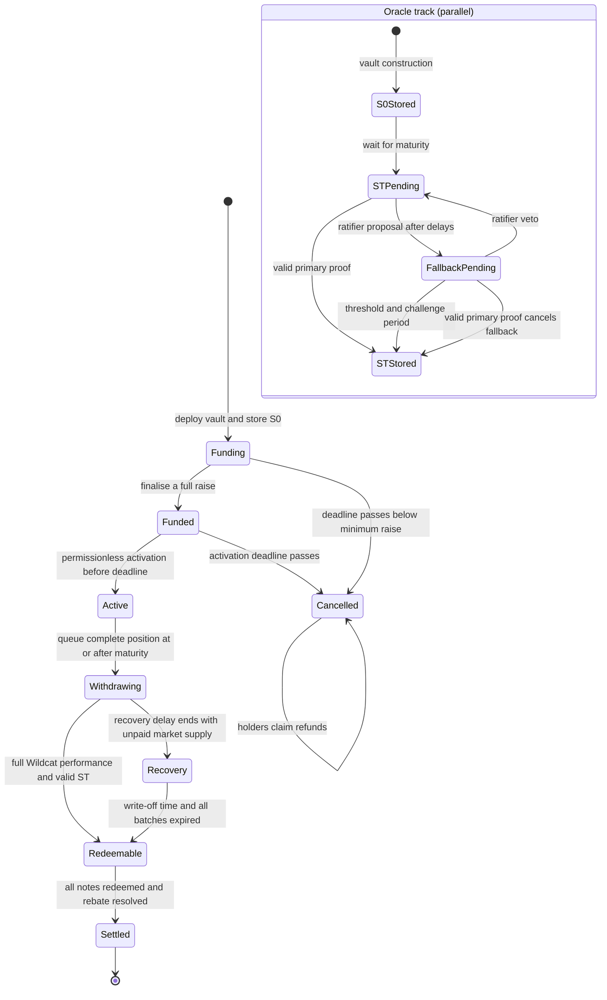

# BRC external review packet

Status: draft review material for a research prototype, reconciled with the integrated repository on
16 August 2026.

This packet defines the review target and records the evidence available in the repository. It is
not an audit report, a legal opinion or an offer document. No external security audit, legal review,
mainnet deployment or independent operational rehearsal has been completed.

## Review baseline and dependency pins

The production-contract baseline is
`efb880e3d79ba12709d68c850b9321eeb19d7cfb` (`feat: add reproducible BRC deployment tooling`). The
integrated documentation and test baseline before this reconciliation is
`9b97787927ee2f9fab2907a9d3762862133fd5cd`. A release commit has not been selected. Each deployment
manifest must replace
`SET_TO_REVIEWED_COMMIT` with the release commit reviewed by the borrower, investors and external
auditor.

| Component | Pin or identity | Review consequence |
| --- | --- | --- |
| BRC application contracts | `efb880e3d79ba12709d68c850b9321eeb19d7cfb` | Exact production-code baseline for this packet |
| Integrated repository | `9b97787927ee2f9fab2907a9d3762862133fd5cd` | Last merged documentation, tests and operations baseline before this reconciliation |
| Wildcat v2 protocol | `99bb85840a77a56fa5f64504a60ec126b6047cf5` | Submodule commit containing the market, factories, fixed-term hook, provider, sanctions and SphereX code |
| forge-std | `467ffd422ca01fed5797a4c766a1e4e3a5327902` | Test and script dependency; not deployed as series logic |
| Chainlink contracts source reference | `f82d1ac09fc5d3190600d308be99a4a509854686` | Provenance recorded for the locally copied interface |
| Local `AggregatorV3Interface.sol` | SHA-256 `b173e1e92b4148d7f09464c09b52cd4aca1552a4689afd276d80b9b5e50c7945` | Checked by `script/check-dependencies.sh` |
| Example BTC/USD proxy | `0xF4030086522a5bEEa4988F8cA5B36dbC97BeE88c` | Ethereum mainnet example only; live code, phase and metadata checks remain deployment steps |
| Compiler profile | Solidity `0.8.28`, Cancun, optimizer enabled with 200 runs, via IR, bytecode hash `none` | Must match the series manifest and deployment wrapper preflight |

The Wildcat pin was the head of `wildcat-finance/v2-protocol#124` when selected. It is not a promise
that the upstream pull request was merged, audited or deployed at an approved address.

## Contract and tooling scope

### Production BRC contracts

| File | Review focus |
| --- | --- |
| `src/BRCNoteVault.sol` | Funding, note token, activation checks, sole-lender position, withdrawal batches, normal settlement, recovery, rebate and redemption |
| `src/BtcUsdFixingOracle.sol` | Initial fixing, first eligible maturity round, proxy phases, fallback proposal, signatures, veto and finalisation |
| `src/BRCMath.sol` | Barrier, principal slash, borrower rebate and pro-rata rounding |
| `src/BRCSeries.sol` | Series terms and lifecycle enum |
| `src/BRCFallback.sol` | Immutable fallback configuration |
| `src/BRCBorrowerAccount.sol` | Registered operational borrower, principal authority, atomic series deployment and later market calls |
| `src/BRCVaultFactory.sol` | Borrower-prefixed CREATE2 vault deployment |
| `src/interfaces/*.sol` | Local ERC-20 and Chainlink boundaries |

### Deployment and verification scope

`src/BRCDeployment.sol`, `script/BRCJson.sol`, `script/DeployBRC.s.sol`,
`script/VerifyBRC.s.sol` and `script/deploy-brc.sh` are in scope because they construct, bind and
verify the deployed series. `BRCDeploymentVerifier` is script-side code, not a production contract:
its measured runtime is 70,852 bytes and exceeds EIP-170. The production `BRCNoteVault` runtime is
23,641 bytes under the pinned profile, leaving 935 bytes below the 24,576-byte limit.

Tests and mocks are evidence, not production scope. They still require review for false assumptions,
missing cases and divergence from pinned dependencies.

### Direct Wildcat dependency surface

The review must follow calls and inherited behaviour into the pinned `HooksFactory`,
`WildcatMarket`, `WildcatArchController`, `WildcatBorrowerIdentityRegistry`,
`WildcatSanctionsSentinel`, sanctions escrow, `SingletonFixedTermHooks`, `FixedTermHooks`, singleton
role provider and factory, SphereX registration code, market accounting libraries, withdrawal batch
libraries, hook configuration and role-provider types. The Wildcat 4626 wrapper factory is a factory
constructor dependency, but the BRC vault does not use the wrapper.

The selected settlement token, Wildcat deployment addresses, Chainalysis feed used by the sanctions
sentinel, SphereX engine and Chainlink proxy are deployment-specific dependencies. The example
manifest does not approve final addresses for them.

## Series state diagram



Queueing and the maturity-price proof run independently. The vault can enter `Withdrawing` without
`ST`. Recovery does not use `ST` and never creates a borrower rebate. `Cancelled` remains the state
after all refunds; `Settled` is reserved for a completed settlement waterfall.

## Authority map

| Actor or dependency | Onchain authority | Limit or commitment | Review and operational question |
| --- | --- | --- | --- |
| Note holder | Transfer notes, approve an operator, refund in `Cancelled`, redeem in `Redeemable` | Transfer eligibility applies when enabled; refund and redemption do not require current eligibility | Confirm legal ownership follows the note balance and the access-controller records |
| Subscriber | Transfer the exact settlement-asset amount and choose the note recipient | Hard cap, deadline and optional eligibility checks | Confirm the payer and beneficial owner relationship is permitted |
| Access controller | Set note-account eligibility | Cannot move vault assets or alter series terms | Identify its owner, policy, outage plan and record-retention duty |
| Any account | Finalise or cancel funding when eligible; activate; queue or execute withdrawals; enter or finalise recovery; finalise normal settlement; submit valid primary oracle evidence | State, time and accounting checks apply; callers receive no protocol payment | Keeper funding and escalation have not been rehearsed |
| Borrower principal recorded at deployment | Sign the atomic deployment; receive a normal-settlement rebate | Manifest, registry, nonce, template and governance values are rechecked in the transaction | Confirm the rebate recipient and legal issuer are the same entity |
| Current principal of `BRCBorrowerAccount` | Use `execute` for Wildcat borrower operations | Determined by the mutable Wildcat identity registry | A post-activation principal change is an accepted credit and legal trust assumption |
| Borrower / market | Repay debt, manage liquidity and close where hooks permit | Fixed-term hooks block early closure, term reduction and APR/reserve changes before maturity | Repayment and close are not permissionless BRC actions |
| Fallback ratifier | Propose fallback evidence, sign an approval or veto a pending proposal | Immutable distinct ECDSA EOAs; one ratifier can veto; threshold signs | Collusion can set a false fallback value and one lost or hostile key can block fallback |
| Signature relayer | Submit any ratifier's valid fallback signature | Signature binds chain, oracle, series, nonce, price, time, evidence hash and source | Publishing signatures discloses evidence and operational timing |
| Chainlink proxy and aggregator administrators | Change the proxy's underlying phase and aggregator state | BRC checks proxy and phase-aggregator metadata and the selected round | Feed governance can delay or prevent a primary proof; no alternate automatic feed exists |
| Wildcat ArchController owner | Register protocol components and change a hook template's protocol fee, then push it to a market | Pinned v2 code caps protocol fee at 1,000 bips | A later fee can reduce default recovery even though activation checked the initial fee |
| SphereX admin and operator | Change the engine and propagate it to the factory or market | Initial roles and engine are recorded, not frozen | A replacement engine can block queueing or withdrawal execution |
| Borrower identity registry administration | Approve account factories and control supported identity transitions | Atomic deployment checks the current principal and registry | Registry availability and governance are external trust inputs |
| Wildcat sanctions sentinel and Chainalysis source | Trigger `nukeFromOrbit` and route sanctioned withdrawals through escrow | Vault can adopt authenticated batches but cannot bypass escrow | Release, reporting and mistaken-designation procedures are external |

## Asset-flow accounting specification

Let `N` be face notional and initial note supply, `K` the stored initial fixing, `B` the stored
barrier, `ST` the stored maturity fixing, `P` authenticated Wildcat proceeds, `R` the borrower
rebate and `H` the noteholder reserve.

### Funding and cancellation

- A subscription of `q` succeeds only when the vault balance rises by exactly `q`; it mints exactly
  `q` notes. Fee-on-transfer receipt is rejected.
- Total note supply cannot exceed `N`. A configured Wildcat series requires a full raise before
  activation.
- Cancellation returns one settlement-asset base unit per note burned. Transfer taxes or a negative
  balance change cause the transaction to revert.
- Unsolicited settlement tokens do not mint notes and do not change refund claims.

### Activation and Wildcat position

- Activation starts from an empty market and zero vault market balance, approves exactly `N`,
  deposits `N`, then clears the allowance.
- The vault requires its balance to fall by `N`, the market's asset balance to rise by `N` and its
  scaled balance to rise by `floor(N * 1e27 / scaleFactor)`.
- `activatedScaledAmount` fixes the complete position that later withdrawal batches must account
  for. The vault records its remaining settlement-token balance as `settlementBaselineBalance`.

### Normal settlement

- `P` is the sum of `normalizedAmountWithdrawn` for authenticated batches that account for all
  `activatedScaledAmount`. The market lender supply must be zero and every batch must be completely
  burned and withdrawn.
- The vault balance must be at least `settlementBaselineBalance + P`. Direct donations are excluded
  because they are not part of the Wildcat batch totals.
- The principal slash is:

```text
R = 0                                      when ST > B or ST >= K
R = floor(N * (K - ST) / K)               otherwise
H = P - R
```

- The slash applies only to face principal. Wildcat interest stays in `H`. Settlement reverts if
  `R > P`.
- `R` is paid once to the borrower principal fixed in the vault at deployment. It does not follow a
  later borrower succession.

### Recovery

- Recovery becomes available only after the configured `recoveryDelay`, from `Withdrawing`, while
  the Wildcat market still has unpaid lender supply. This is separate from Wildcat's
  `delinquencyGracePeriod`.
- At or after write-off eligibility, every recorded batch must have expired. Finalisation first
  executes any amount then withdrawable and sets `P` to the authenticated amount withdrawn.
- Recovery fixes `R = 0` and `H = P`. A later Wildcat payment or token donation is outside the note
  pool.

### Redemption and terminal accounting

- For a non-final redemption of `q` notes, the payout is `floor(H * q / N)`.
- When `q` equals the remaining note supply, the payout is the remaining reserve
  `H - redeemedAssets`. This assigns accumulated division dust to the final redeemer.
- At every point, `redeemedAssets <= H`. `Settled` requires zero note supply and either a paid rebate
  or a zero/recovery rebate.
- The intended conservation statement is:

```text
authenticated Wildcat proceeds = borrower rebate + noteholder reserve
noteholder reserve = redeemed assets + remaining noteholder reserve
```

Pre-activation surplus, post-snapshot payments and unsolicited transfers are deliberately outside
these equations and have no vault sweep path.

## Known limitations and rejected alternatives

| Decision or limitation | Current treatment | Consequence |
| --- | --- | --- |
| Research status | No external audit, legal sign-off or production deployment | Do not describe the series as audited or suitable for public distribution |
| Non-upgradeable vault | No proxy, delegatecall, market setter or admin sweep | Terms cannot be repaired after deployment; a defect or dependency failure can strand value |
| No Wildcat 4626 wrapper | Vault holds the sole market position directly | Wrapper integrations cannot be assumed to work with the BRC waterfall |
| European barrier | Observe once at maturity | No continuous or American barrier protection |
| Cash settlement | Pay settlement tokens only | Investors never receive BTC; legal option treatment needs advice |
| Primary oracle proof | First valid proxy round at or after maturity; at most 32 intervening rounds may be scanned | A longer or unreadable history blocks the primary route and eventually requires fallback |
| Fallback oracle | Immutable EOA ratifiers, threshold approval, single-ratifier veto and fixed evidence hash/source | The contract cannot prove primary evidence is absent or prove the fallback evidence is true |
| No contract-wallet ratifiers | Deployment requires `code.length == 0` and uses `ecrecover` | Safe and ERC-1271 signers are unsupported; counterfactual wallets need an offchain rehearsal |
| Settlement token behaviour | Exact balance changes are required; no-return ERC-20 calls are accepted | Fee-on-transfer and rebasing behaviour can revert lifecycle calls; token governance remains external |
| Direct donations | Excluded from funding, proceeds and recovery snapshots | Donated or late-arriving tokens can remain permanently outside claims |
| Wildcat governance | Initial fee, roles and SphereX engine are recorded; later changes remain possible | Fee priority or a blocking engine can change recovery and liveness after activation |
| Borrower succession | Rejected before activation unless it matches the manifest; accepted after activation | Operational control can change while the deployment-fixed rebate recipient does not |
| Sanctions escrow | Adopt authenticated `nukeFromOrbit` batches; no local escrow bypass | A sanctioned or mistakenly classified vault can wait indefinitely for external release |
| Withdrawal timestamp width | Terms reserve room below `uint32`; queueing checks again | Missing the last safe queue time leaves no onchain settlement or recovery transition |
| Recovery finality | Permissionless snapshot after a fixed write-off time | Later payments do not enlarge note claims and there is no reopen path |
| Verifier size | Run as Forge script only | `BRCDeploymentVerifier` cannot be treated as a deployable onchain verifier under EIP-170 |

Rejected alternatives are an upgradeable vault, a mutable post-deployment market setter, the
canonical 4626 wrapper, `latestRoundData()` chosen at settlement time, continuous barrier
monitoring, immediate unchallenged fallback, arbitrary third-party fallback proposals, Safe
ratifiers without ERC-1271 support, partial-raise activation and early note redemption. Each would
either add mutable authority, permit price selection, weaken the singleton lender invariant or
change the product described in `docs/product-terms.md`.

## Upstream upgrade assumptions

1. The review applies only to Wildcat commit
   `99bb85840a77a56fa5f64504a60ec126b6047cf5`. Replacing it requires a new diff review of market
   accounting, withdrawal batches, sanctions, fixed-term hooks, role providers, borrower identity,
   protocol fees and SphereX.
2. A final upstream `SingletonFixedTermHooks` release is not assumed equivalent to the pin. Its
   template initcode, constructor encoding, dispatch policy, provider seal and runtime must be
   checked again.
3. Deployment uses approved live factory and template addresses only after codehash and stored-policy
   checks. The example manifest contains zero placeholders and is not deployable as an approval
   record.
4. Chainlink proxy phases are mutable. The feed address, decimals and description hash are fixed in
   the series, while each maturity proof resolves and checks the phase aggregator.
5. The settlement token is not upgrade-frozen by BRC. Proxy upgrades, pauses, blacklists and balance
   changes can affect funding, repayment, refunds and redemption.
6. Chainalysis, the sanctions sentinel and SphereX are not controlled by the vault. Their continued
   availability and governance belong in operational monitoring and the legal allocation of risk.

## Legal questions requiring advice

No answer in this section has been obtained.

| Topic | Questions for counsel |
| --- | --- |
| Note distribution | Is the note a security, transferable security, collective investment, deposit, consumer product or another regulated instrument in each target jurisdiction? Who may offer, market, arrange, advise on, custody or resell it? Which investor-qualification, KYC, disclosure, legend and transfer-control rules apply? |
| Oracle and data licensing | Do the Chainlink terms permit onchain use, reproduction in evidence packets and publication of historical round data? Who licenses the fallback source, and may its raw evidence and derived fixing be published to ratifiers and investors? What attribution and retention terms apply? |
| Sanctions | Which US, UK, EU and other sanctions regimes govern the issuer, borrower, operators and holders? When must subscriptions, transfers, refunds, rebates or redemptions be blocked or reported? Who can request escrow release or correct a false designation, and how are frozen assets recorded? |
| Cash-settled option treatment | Does the barrier-linked principal reduction create an option, swap, contract for difference or other derivative? Do eligible-counterparty, margin, reporting, venue, clearing, commodities, gaming or financial-promotion rules apply? Who is the option writer and who owns the hedge and Wildcat credit exposure? |
| Stablecoin and insolvency | How are USDC claims, Wildcat debt, borrower default, post-write-off payments and trapped surplus treated in insolvency? Does the onchain waterfall match the contractual priority and title analysis? |
| Borrower succession and governance | What consent and notice are required if the registered principal, protocol fee, SphereX engine, sanctions policy or Chainlink phase changes during the term? Does the fixed rebate recipient remain correct after succession? |

## Verification and rehearsal evidence

Evidence recorded on 15 August 2026 from the packet-preparation workspace:

| Check | Result | Qualification |
| --- | --- | --- |
| `script/check-dependencies.sh` | Passed | Reported the Wildcat, forge-std and Chainlink pins in this packet |
| `FOUNDRY_PROFILE=ci forge test` | 229 passed, 0 failed, 1 skipped | Includes 1,000 cases per fuzz test and 256 runs per stateful invariant; inherited test contracts repeat some cases, so 229 is not a count of unique scenarios |
| Mainnet-fork test | Skipped | `MAINNET_RPC_URL` was absent |
| Separately reported fork exercise | Passed, without a raw transcript in this packet | `docs/validation-evidence.md` records a pass against the live BTC/USD proxy; the test then deploys pinned factory/template artefacts on the fork and does not use approved live Wildcat factory addresses or produce deployment-verifier output |
| Mainnet-fork deployment verifier output | Not performed | No manifest, deployment record or verifier transcript from an approved mainnet-fork deployment exists |
| Production size check | `BRCNoteVault` 23,641 bytes; `WildcatMarket` 22,863 bytes | Both fit EIP-170 under the pinned profile; script-side `BRCDeploymentVerifier` does not |
| Stateful lifecycle handlers | Passed | Funding and live-series handlers mix every task-11 action class and check conservation, transition, rebate, reserve and terminal properties |
| Independent high-precision payoff model | Passed | `BRCSystemPayoffDifferentialTest` checks the implementation against exact-rational quotient bounds over fuzzed full-width inputs |
| Historical Chainlink fixtures | Not run | Mock phase, stale and missing-round tests exist; historical mainnet data has not been replayed |
| Bounded gas programme | Passed locally | `.gas-snapshot` records 526,475 gas for cold-state `recordMaturityFixing` with the maximum accepted 32-round proof and 628,307 gas for cold-state `finalizeRecovery` while it executes eight paid adopted batches and checks the unpaid live batch; the tests enforce respective ceilings of 650,000 and 1,500,000 gas, with setup and assertions outside the metered sections |
| Independent maturity and recovery rehearsal | Not performed | No rehearsal by a person who did not write the contracts has been recorded |
| External security audit | Not performed | There are no external finding IDs or closure attestations |
| Legal review | Not performed | Every question above remains open |

The local test command also printed an `unresolved symbol locals` diagnostic for pinned SphereX source
before completing with a passing result. This must be explained or removed from the release toolchain;
the passing exit status alone is not evidence that the diagnostic is harmless.

## Review issues and findings register

The entries below came from internal adversarial review while building the stack. They are not
external-audit findings and do not replace independent review. The fixing commit is the first
reviewable stack commit containing the stated disposition; later commits inherit it.

| ID | Internal review issue | Disposition and evidence | Fixing commit |
| --- | --- | --- | --- |
| INT-01 | A maturity caller must not choose a favourable later round or skip an unreadable intermediate round | First-eligible proof, proxy-phase checks, a 32-round bound and fail-closed unreadable-round handling; covered in `BtcUsdMaturityFixingTest` | `5bc19a186c33be398db5451e1844548589fbaca9` |
| INT-02 | Fee-on-transfer, rebase or unsolicited surplus could break one-note-per-unit funding and refunds | Exact balance-delta checks, hard-cap accounting and surplus-tolerant liabilities; covered in `BRCNoteVaultTest` | `cf9bfba678fa75c1bfac9ae471fece21e0442c3b` |
| INT-03 | Activation could bind the wrong borrower, market terms, provider, hook policy, fees or pre-existing market position | Full-raise activation, manifest-backed policy checks, singleton zero-TTL provider, sealed provider set, empty-market checks and pinned deployment profile | `fb18c8d80227cd4c7bc6284ae113813ec3b435bf` |
| INT-04 | Normal settlement could pay a rebate before complete performance, count donations or make redemption order change aggregate claims | Authenticated complete-batch accounting, zero market supply, principal-only slash, donation exclusion and final-redeemer dust assignment; covered in `BRCSettlementTest` | `92c04ca7dd88b21005b142a5313065b4945f37b4` |
| INT-05 | Default, sanctions batches or fallback governance could create a rebate, omit recoveries, allow proposal-slot griefing or accept replayed evidence | Authenticated batch adoption, unpaid-supply recovery predicate, terminal recovery snapshot, no recovery rebate, ratifier-only proposals, domain-bound signatures, veto and primary-proof priority | `9a98770419e8886983c4d8f4cf347495d45a8b2d` |
| INT-06 | Separate vault/market deployment, stale hook nonces, mutable template/governance state, unsafe fee approval or mutable build inputs could invalidate a signed manifest | Registered borrower account performs atomic CREATE2 and market deployment; principal, nonce, fees and governance are checked twice; exact fee allowance is cleared; wrapper pins commits/profile and rejects build overrides | `efb880e3d79ba12709d68c850b9321eeb19d7cfb` |

### External-audit register

| External ID | Auditor | Severity | Status | Fix or acceptance commit |
| --- | --- | --- | --- | --- |
| None | No external audit performed | N/A | Open release requirement | N/A |

For each future external finding, preserve the auditor's identifier and severity, link the exact
report text, record whether the issue was fixed or accepted, and tie that disposition to a full
commit hash. A release candidate remains blocked while any finding lacks a recorded disposition.

## Release blockers recorded by this packet

- Select and freeze a release commit, then put it in the series manifest.
- Complete an external security audit and populate the external register.
- Obtain written legal advice for the questions above and reconcile it with the terms and manifest.
- Replay historical oracle data, including phase changes and unavailable rounds, against a pinned mainnet fork.
- Produce a mainnet-fork deployment and verifier transcript using approved live dependency addresses.
- Explain the pinned SphereX compiler diagnostic.
- Rehearse maturity, fallback, sanctions and recovery operations with an independent operator.
- Assign funded keepers, monitoring owners, response times and escalation contacts in the operational
  checklist.

Until those items are closed, this repository establishes a review target, not release approval.
